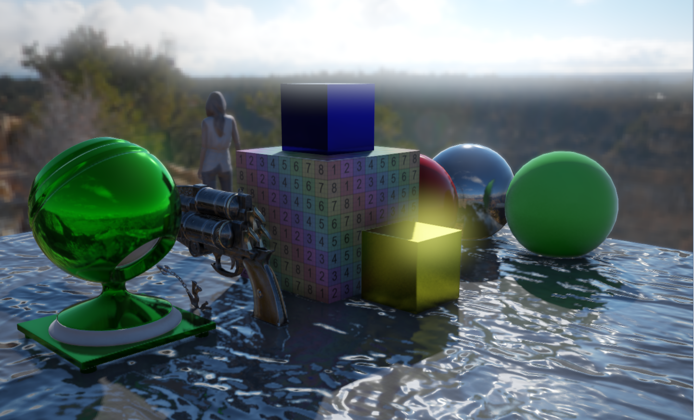
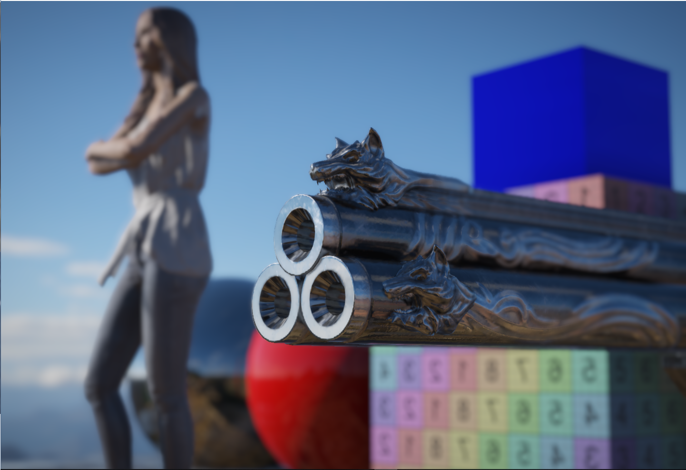
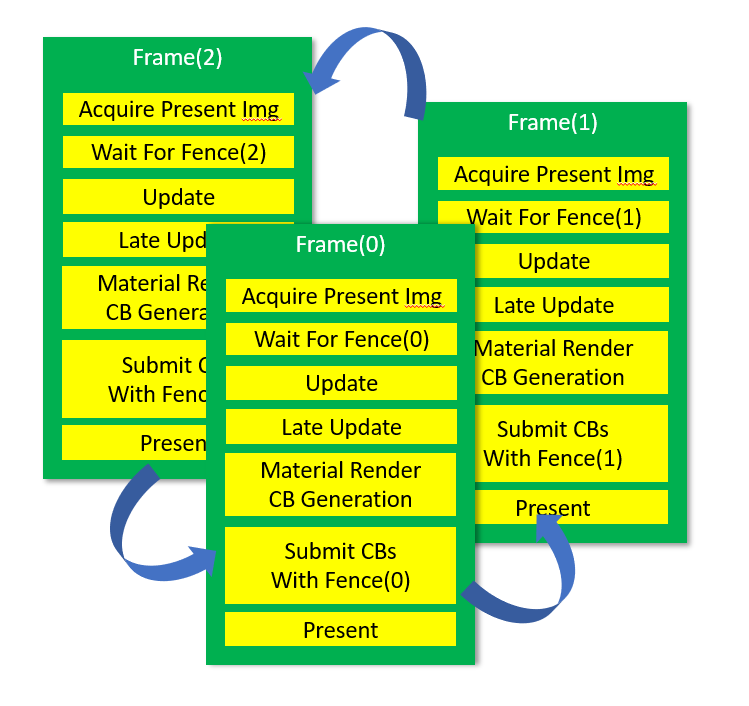

A 3D sample project that is used for my Vulkan practicing.

What I've implemented:
1. AZDO and batching by material
2. Deferred
3. Shadow Map
4. SSAO
5. Bloom(Improved multi pass blur)
6. Motion Blur(With improved tilemax and neighborhood max)
7. Temporal AA
8. Stochastic Screen Space Reflection(Try to implement according to the docs of Frostbite)
9. Physical Based Camera(prerequisites of DOF)
10. DOF

What I want to do later:
1. Clusterred Deferred
2. Cascade Shadow Map

What needs to improve:
1. SSSR on rough materials, to reduce variance that seriously impact visual quality.
2. Simplify TAA's parameters.

Since the variance of SSSR on rough surface is large, I did some tricks in TAA's shader to automatically adjust its response according to maximum tiled neighborhood motion vector.
However, it's quite tricky to adjust all the parameters to achieve a good result. It forces me to trade variance with blurness in the end.

Variance reducing is the only solution.

# A Scene Viewer Rendered By Vulkan
## Introduction
I created this project aiming to get familiar with Vulkan through varies common rendering technologies. It is also a minor engine that handles scene management and data to coordinate with underlay Vulkan and get things drawn on screen. I've already added a lot of functionalities helping to create a scene by a few lines of code. However, there's still a vast gap between this project and a common game engine, both in terms of utilities that helps to ease the work, and a UI editor to do things dynamically rather than code stuff and rebuild.
## Scene Graph
The scene graph of this application is similar to unity. I mean I implemented them the way exactly as how unity works. The whole scene is combined with many objects and each of them might contain one or more components that handles varies kinds of work.

## Frame Graph
### Frame Work
I use triple ring swapchain images as a base count to organize rendering work per-frame. Each one of frames has its index used to acquire corresponding resources as well as synchronization primitives.

### Frame Resources
Every frame of a specific index 0, 1 and 2 holds its own resources, including command pool, frame buffers and synchronization primitives. I don't use per-frame descriptor pool however, since I allocated 3 times larger space of every uniforms and bind them with specific offset according to frame index, so that I don't really have to change descriptor sets and descriptor pools.

## Memory Management
Memory management is sophisticated in my project. There're 2 levels of memory management, memory level that is the management of relationship between memory and its holders(buffers, images), and buffer & image level, as the name suggests, it manages both buffers & images memory, to ease the use of them during rendering organization, and avoid per-frame operations to improve performance.
### Memory Level Management
Memory level management isn't actually general, since you can't just simply allocate a chunk of memory for everything. Buffers and Images must be bound to separate memory(At least validation layer told me so), and different images cannot share the same memory(Also told by validation layer). Therefore, I separated memory usage to buffer and image.
#### Memory Management for buffers
There'll be 32 chunks of memory in "Buffer Memory Pool", exactly the same as Vulkan physical device provided "VK_MAX_MEMORY_TYPES", and each of them consists of a size, data ptr, handle to Vulkan memory objects, and a KEY. The key here is very important as it acts as a role to index the actual binding information, and it'll be generated and kept by each buffer, to look up informations in binding table, and using "type index" to acquire Vulkan memory object from "Buffer Memory Pool"

#### Memory Management for images
### Buffer & Image Level Management
I created a class "SharedBufferManager" to manage a big buffer from which varies types of buffers will allocate. During the time of command buffer generation, this big buffer will be bound along with an offset and range. I do this to follow the best practice of NVdia's document, without knowing why;). I do know that for uniform buffers, binding them with "vkoffsets" is a lot cheaper than switching descriptor sets, not to mention update them. This way I can avoid either switching and updating descriptor sets, seems like a perfect path to go.

 1. Each vertex buffer is allocated from a specific shared buffer manager associated with a vertex format.
 2. Each index buffer is allocated from global shared buffer manager.
 3. Each indirect buffer is allocated from global shared buffer manager.
 4. Each uniform buffer is allocated from global shared buffer manager.
 5. Each shader storage buffer is allocated from global shared buffer manager.
 6. Each texture is allocated directly with a  segment of memory.
## Render Graph

