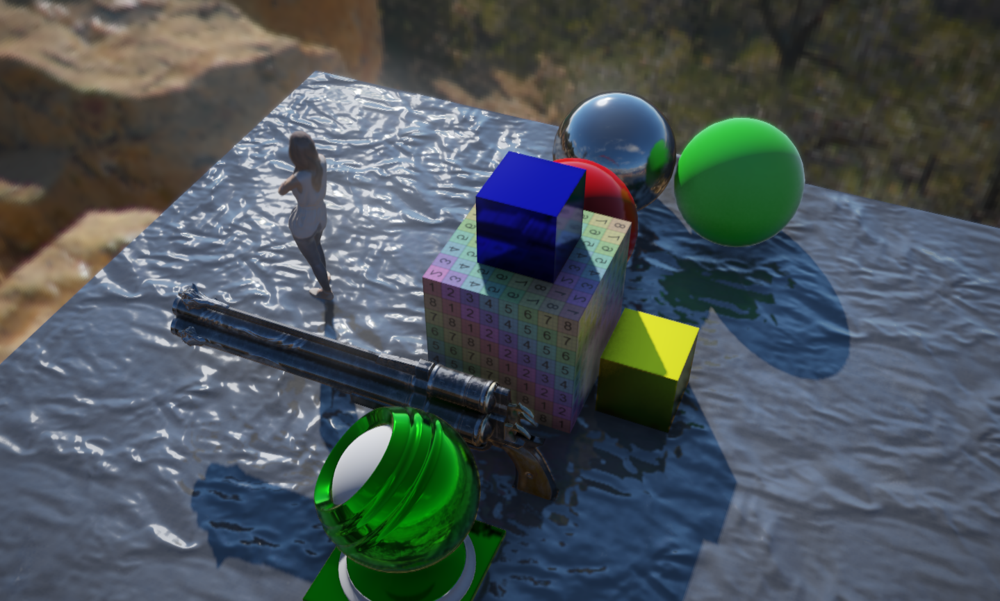

A 3D sample project that is used for my Vulkan practicing.

What I've implemented:
1. AZDO and batching by material
2. Deferred
3. Shadow Map
4. SSAO
5. Bloom(Improved multi pass blur)
6. Motion Blur(With improved tilemax and neighborhood max)
7. Temporal AA
8. Stochastic Screen Space Reflection(Try to implement according to the docs of Frostbite)
9. Physical Based Camera(prerequisites of DOF)

What I want to do later:
1. Clusterred Deferred
2. Cascade Shadow Map

What needs to improve:
1. SSSR on rough materials, to reduce variance that seriously impact visual quality.
2. Simplify TAA's parameters.

Since the variance of SSSR on rough surface is large, I did some tricks in TAA's shader to automatically adjust its response according to maximum tiled neighborhood motion vector.
However, it's quite tricky to adjust all the parameters to achieve a good result. It forces me to trade variance with blurness in the end.

Variance reducing is the only solution.

